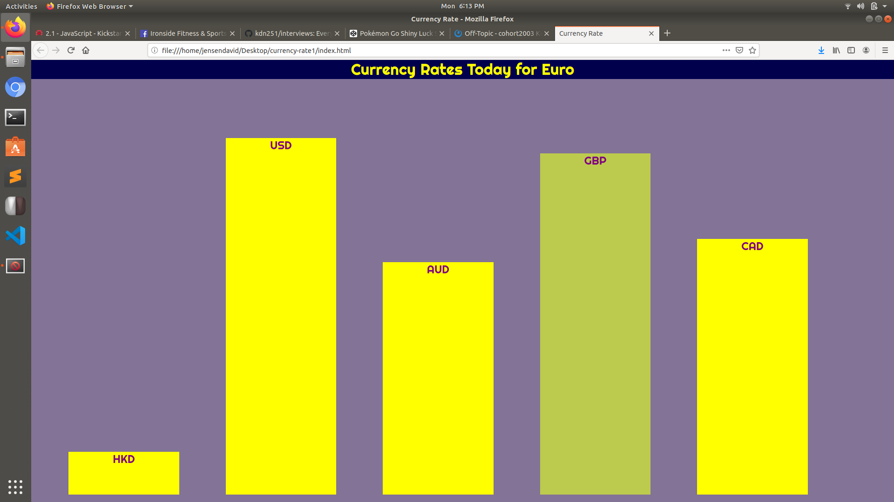

# currency-rate1

This is homework 1 for the Kickstart Coding front-end curriculum.

It is a bar graph of the currency rate for Euro compared to 5 other currencies.

The data is based from the API: https://api.exchangeratesapi.io/latest

Here is a screenshot of the bar graph with the color change transition in effect

